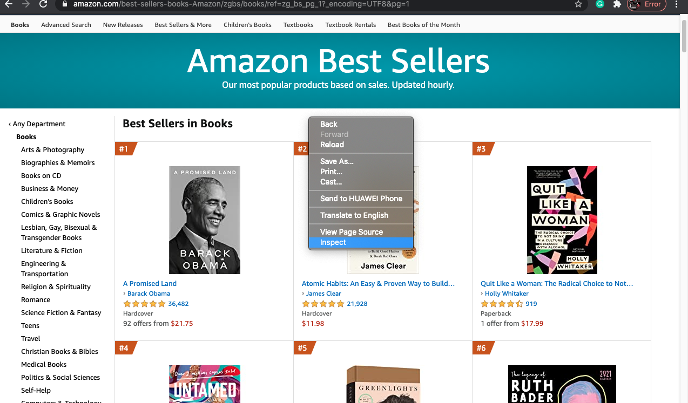
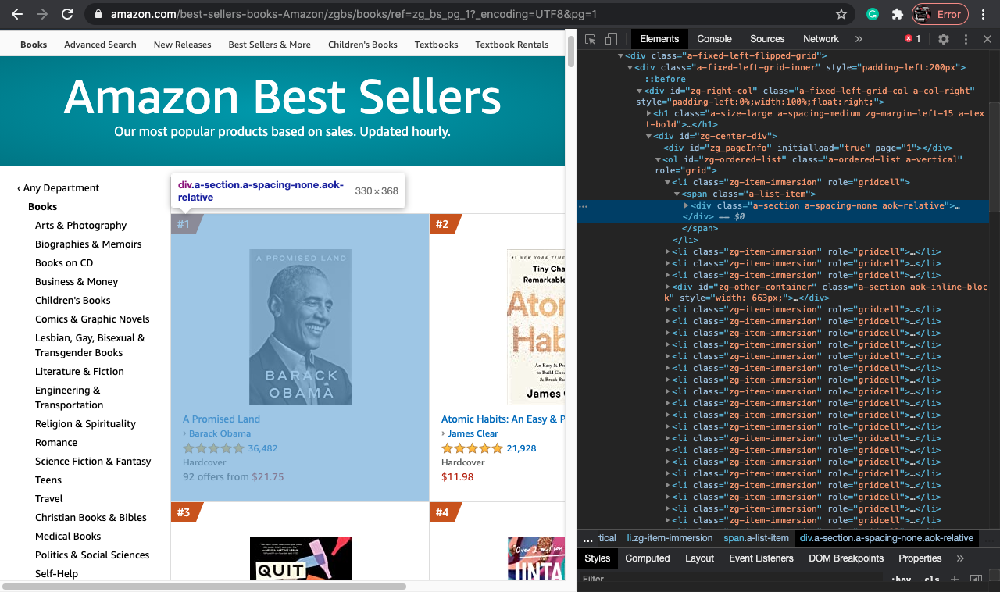
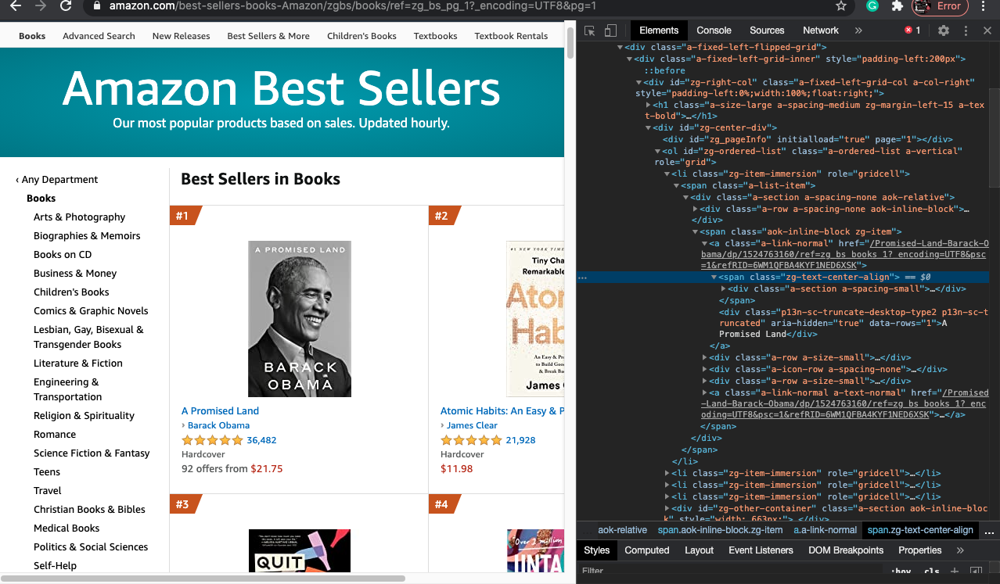
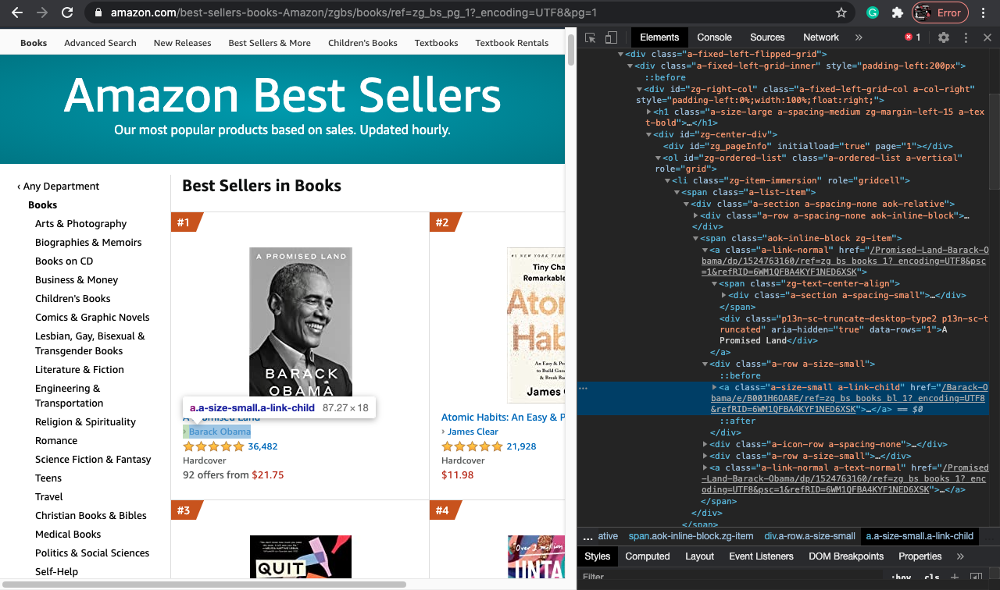
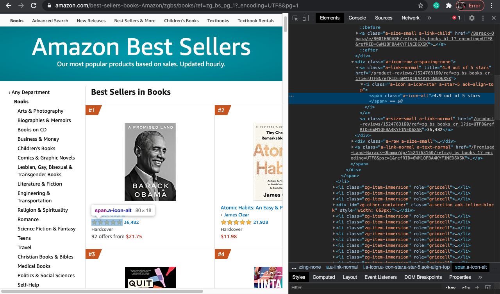
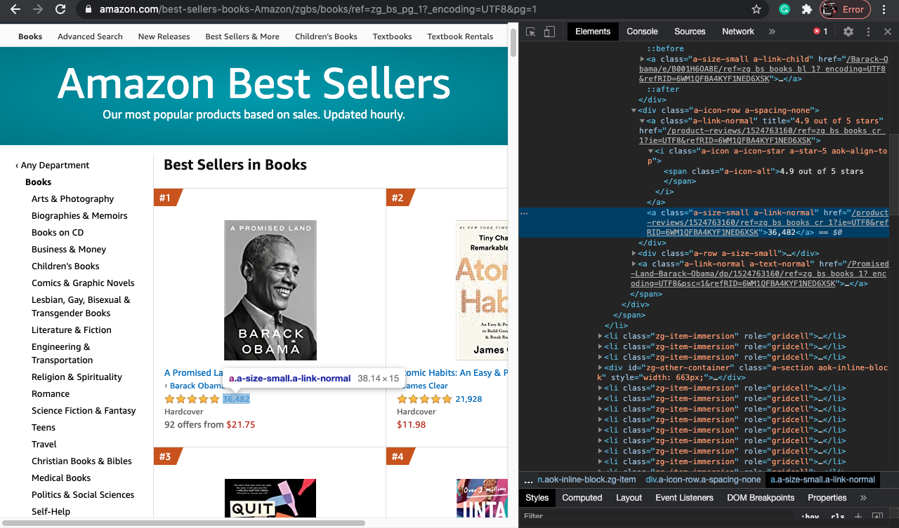
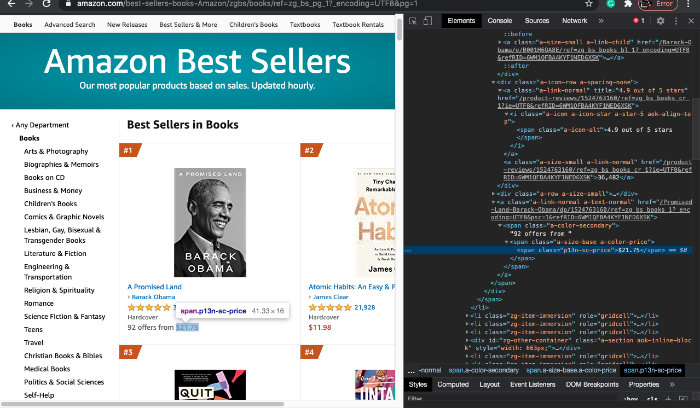

# Web Scraping using Python

Read this before you start. 

There are three Jupyter Notebooks (as of now). And they are:

1. GoogleWebScrape.ipynb - Here, the result will return first page of the Google search result of whatever input query you put. For example, I have put "J. Cole" as the query input. You can put anything and see for yourself. The result will return the title and the link of the Google search result. 

2. NBAWebScrape.ipynb - Here, the input url is the [Basketball Reference](https://www.basketball-reference.com/playoffs/). Using BeautifulSoup we will scrape the data from the site and save the data into a CSV file, called NBAFinalsChampions.csv. Run the Jupyter Notebook and the output of it will be the CSV file, NBAFinalsChampions.csv.

3. AmazonBooksWebScrape.ipynb - Here, the input url is [Amazon Books Bestseller](https://www.amazon.com/best-sellers-books-Amazon/zgbs/books/ref=zg_bs_pg_1?_encoding=UTF8&pg=1). If you cannot access the Amazon Books Bestseller link, this is the [Parent Link](https://www.amazon.com/gp/bestsellers/books/) (You will for sure be able to access the parent link). I would recommend you to access the parent link. Click on the parent link, then go to the bottom page with the page numbers. After this, click on page 1 and then take the URL. You have to extract the following data: Book Name, Author, Rating, Customers Rated and Price. Before scraping the data, inspect the page as shown below. 

 

Now, select the section after the h1 tag of 'Bestsllers in Books'. This is the parent tag and when you hover over it, all the required elements are highlighted. 

 

Now, you will have to find the the attributes for book name, author, rating, customers rated, and price. There will be a list (li) of items, click on first the item (or any li) and then select the section as shown below for the name of the book. 

 

Likewise we will select the section for the author, rating, customers rated and price.

Author section that is the author of the book. 

Rating section that is the rating of the book

 

Customers rated that is the number of customers who rated

 

Price section that is the price of the book

 

4. NBAPredictions.ipynb - Here, the input url is https://projects.fivethirtyeight.com/2021-nba-predictions/. The data turned out to be an HTML Table after I inspected the website. So, first extracted the HTML Table and then converted it to a CSV File. 

### You can either run the Python scripts or the Jupyter Notebook whatever you prefer. I have provided both the Python scripts and the Jupyter Notebook. 
